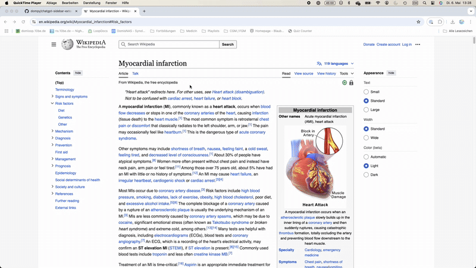

# ChatGPT Med Sidebar

A Chrome extension for clinicians and medical professionals that explains selected terms using ChatGPT – directly on any website.

---

## 🩺 What it does

- 💬 Explains selected words or sentences with a short, professional GPT-3.5 response
- 🧠 Chat continues in a compact overlay window with full history
- 🔄 Suggests dynamic, relevant follow-up questions (auto-generated)
- 🖥️ Clean UI based on ChatGPT design, optimized for quick clinical reading

---

## 💻 Features

- Medical context-aware explanations
- Smart follow-up buttons
- User/assistant chat bubbles with alignment
- Input field + send button with keyboard support
- Modern GPT-style colors and fonts
- Local API key + project ID handling via settings page

---

## 🚀 How to use

1. Load the extension via `chrome://extensions` (Developer mode → "Load unpacked")
2. Go to any webpage
3. Select a term → 💬 “Explain” button appears
4. Click to open sidebar chat

> Make sure to set your OpenAI `apiKey` and `projectId` via the options page first.

---

## 🛠 Setup

1. Clone or download this repository
2. Open Chrome and go to `chrome://extensions`
3. Enable Developer Mode
4. Click "Load unpacked" → select this folder
5. Configure your API key under Extension Options

---

## 🔐 API Key Setup

You must provide your own OpenAI API Key and Project ID:

1. Click the extension icon → right-click → "Options"
2. Paste your `sk-proj-...` API key and your project ID
3. Save and reload

---

## 📦 Key Files

- `popup.js` – chat interface logic
- `content.js` – selection handler and trigger button
- `chat.html` – iframe chat container
- `styles.css` – interface styling
- `options.html` – key entry form
- `manifest.json` – Chrome Extension definition

---

## 📘 License

MIT – free to use, modify, and share with attribution.